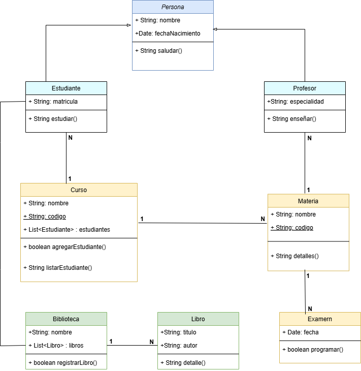

# gestion-academica

## Diagrama de clases



## Clase persona: 
````
package es.ies.puerto.persona;
import java.util.Date;
import java.util.Objects;
/**
 * @author habccode,
 * @version 1.0.0
 */
public class Persona {
    protected String nombre;
    protected Date fechaNacimiento;

    /**
     * Constructor por defecto.
     */
    public Persona() {
    }

    /**
     * Constructor general.
     * @param nombre
     * @param fechaNacimiento
     */
    public Persona(String nombre, Date fechaNacimiento) {
        this.nombre = nombre;
        this.fechaNacimiento = fechaNacimiento;
    }

    public String getNombre() {
        return this.nombre;
    }

    public void setNombre(String nombre) {
        this.nombre = nombre;
    }

    public Date getFechaNacimiento() {
        return this.fechaNacimiento;
    }

    public void setFechaNacimiento(Date fechaNacimiento) {
        this.fechaNacimiento = fechaNacimiento;
    }

    /**
     * Función que muestra el nombre y la edad de la persona.
     * @return el nombre y la edad de la persona.
     */
    public String saludar() {
        return "";
    }

    @Override
    public boolean equals(Object o) {
        if (o == this)
            return true;
        if (!(o instanceof Persona)) {
            return false;
        }
        Persona persona = (Persona) o;
        return Objects.equals(this.nombre, persona.nombre) && Objects.equals(this.fechaNacimiento, persona.fechaNacimiento);
    }

    @Override
    public int hashCode() {
        return Objects.hash(nombre, fechaNacimiento);
    }

    @Override
    public String toString() {
        return "{" +
            " nombre='" + getNombre() + "'" +
            ", fechaNacimiento='" + getFechaNacimiento() + "'" +
            "}";
    }
    
}

````


## Clase Profesor:
````
package es.ies.puerto.persona;
import java.util.Date;
import java.util.Objects;
/**
 * @author habccode.
 * @version 1.0.0
 */
public class Profesor extends Persona{
    private String especialidad;

    /**
     * Constructor por defecto.
     */
    public Profesor() {
    }

    /**
     * Constructor general.
     * @param especialidad
     */
    public Profesor(String especialidad) {
        this.especialidad = especialidad;
    }

    /**
     * Constructor general con los atributos heredados de la clase Persona.
     * @param especialidad
     * @param nombre
     * @param fechaNacimiento
     */
    public Profesor(String especialidad, String nombre, Date fechaNacimiento) {
        this.especialidad = especialidad;
        this.nombre = nombre;
        this.fechaNacimiento = fechaNacimiento;
    }

    public String getEspecialidad() {
        return this.especialidad;
    }

    public void setEspecialidad(String especialidad) {
        this.especialidad = especialidad;
    }

    /**
     * Confirma que el profesor progresa en su enseñanza.
     * @return true si el profesor enseña.
     */
    public boolean enseniar() {
        return true;
    }

    @Override
    public boolean equals(Object o) {
        if (o == this)
            return true;
        if (!(o instanceof Profesor)) {
            return false;
        }
        Profesor profesor = (Profesor) o;
        return Objects.equals(this.especialidad, profesor.especialidad);
    }

    @Override
    public int hashCode() {
        return Objects.hash(especialidad);
    }

    @Override
    public String toString() {
        return "{" +
            " especialidad='" + getEspecialidad() + "'" +
            "}";
    }
    
}
````


## Clase Estudiante: 
````
package es.ies.puerto.persona;

import java.sql.Date;
import java.util.Objects;

/**
 * @author habccode.
 * @version 1.0.0
 */
public class Estudiante extends Persona{
    private String matricula;

    /**
     * Constructor por defecto.
     */
    public Estudiante() {
    }

    /**
     * Constructor solo con la matricula.
     * @param matricula
     */
    public Estudiante(String matricula) {
        this.matricula = matricula;
    }

    /**
     * Constructor general con los atributos heredados de la clase Persona.
     * @param matricula
     * @param nombre
     * @param fechaNacimiento
     */
    public Estudiante(String matricula, String nombre, Date fechaNacimiento) {
        this.matricula = matricula;
        this.nombre = nombre;
        this.fechaNacimiento = fechaNacimiento;
    }

    public String getMatricula() {
        return this.matricula;
    }

    public void setMatricula(String matricula) {
        this.matricula = matricula;
    }

    /**
     * Confirma que el estudiante progresa en sus estudios.
     * @return true si el estudiante estudia.
     */
    public boolean estudiar() {
        return true;
    }

    @Override
    public boolean equals(Object o) {
        if (o == this)
            return true;
        if (!(o instanceof Estudiante)) {
            return false;
        }
        Estudiante estudiante = (Estudiante) o;
        return Objects.equals(this.matricula, estudiante.matricula);
    }

    @Override
    public int hashCode() {
        return Objects.hash(matricula);
    }

    @Override
    public String toString() {
        return "{" +
            " matricula='" + getMatricula() + "'" +
            "}";
    }
    
}
````

## Clase Curso: 
````
package es.ies.puerto.persona;
import java.util.List;
import java.util.Objects;
/**
 * @author habccode
 * @version 1.0.0
 */
public class Curso {
    private String nombre;
    private String codigo;
    private List<Estudiante> estudiantes;

    /**
     * Constructor por dfecto.
     */
    public Curso() {
    }

    /**
     * Constructor solo con el codigo.
     * @param codigo
     */
    public Curso(String codigo) {
        this.codigo = codigo;
    }

    /**
     * Constructor general.
     * @param nombre
     * @param codigo
     * @param estudiantes
     */
    public Curso(String nombre, String codigo, List<Estudiante> estudiantes) {
        this.nombre = nombre;
        this.codigo = codigo;
        this.estudiantes = estudiantes;
    }

    public String getNombre() {
        return this.nombre;
    }

    public void setNombre(String nombre) {
        this.nombre = nombre;
    }

    public String getCodigo() {
        return this.codigo;
    }

    public void setCodigo(String codigo) {
        this.codigo = codigo;
    }

    public List<Estudiante> getEstudiantes() {
        return this.estudiantes;
    }

    public void setEstudiantes(List<Estudiante> estudiantes) {
        this.estudiantes = estudiantes;
    }

    /**
     * Agrega un estudiante a la lista.
     * @return true si el estudiante due añadido.
     */
    public boolean agregarEstudiante() {
        return true;
    }

    /**
     * Muestra los estudiantes que hay en la lista.
     * @return la lista de estudiantes.
     */
    public String listarEstudiantes() {
        return "";
    }

    @Override
    public boolean equals(Object o) {
        if (o == this)
            return true;
        if (!(o instanceof Curso)) {
            return false;
        }
        Curso curso = (Curso) o;
        return Objects.equals(this.codigo, curso.codigo);
    }

    @Override
    public int hashCode() {
        return Objects.hash(codigo);
    }

    @Override
    public String toString() {
        return "{" +
            " nombre='" + getNombre() + "'" +
            ", codigo='" + getCodigo() + "'" +
            ", estudiantes='" + getEstudiantes() + "'" +
            "}";
    }
    
}
````


## Clase Materia: 
````
package es.ies.puerto.persona;
import java.util.Objects;
/**
 * @author habccode
 * @version 1.0.0
 */
public class Materia {
    private String nombre;
    private String codigo;

    /**
     * Constructor por defecto.
     */
    public Materia() {
    }

    /**
     * Constructor solo con el codigo.
     * @param codigo
     */
    public Materia(String codigo) {
        this.codigo = codigo;
    }

    /**
     * Constructor general.
     * @param nombre
     * @param codigo
     */
    public Materia(String nombre, String codigo) {
        this.nombre = nombre;
        this.codigo = codigo;
    }

    public String getNombre() {
        return this.nombre;
    }

    public void setNombre(String nombre) {
        this.nombre = nombre;
    }

    public String getCodigo() {
        return this.codigo;
    }

    public void setCodigo(String codigo) {
        this.codigo = codigo;
    }

    /**
     * Muestra los detalles de la materia.
     * @return
     */
    public String detalles() {
        return "";
    }

    @Override
    public boolean equals(Object o) {
        if (o == this)
            return true;
        if (!(o instanceof Materia)) {
            return false;
        }
        Materia materia = (Materia) o;
        return Objects.equals(this.codigo, materia.codigo);
    }

    @Override
    public int hashCode() {
        return Objects.hash(nombre, codigo);
    }

    @Override
    public String toString() {
        return "{" +
            " nombre='" + getNombre() + "'" +
            ", codigo='" + getCodigo() + "'" +
            "}";
    }
    
}

````


## Clase Examen: 

````
package es.ies.puerto.persona;

import java.util.Date;
import java.util.Objects;
/**
 * @author habccode
 * @version 1.0.0
 */
public class Examen {
    private Date fecha;
    private String codigo;

    /**
     * Constructor por defecto.
     */
    public Examen() {
    }

    /**
     * Constructor solo con el codigo.
     * @param codigo
     */
    public Examen(String codigo) {
        this.codigo = codigo;
    }

    /**
     * Constructor general.
     * @param fecha
     * @param codigo
     */
    public Examen(Date fecha, String codigo) {
        this.fecha = fecha;
        this.codigo = codigo;
    }

    public Date getFecha() {
        return this.fecha;
    }

    public void setFecha(Date fecha) {
        this.fecha = fecha;
    }

    public String getCodigo() {
        return this.codigo;
    }

    public void setCodigo(String codigo) {
        this.codigo = codigo;
    }

    /**
     * Muestra los detalles del examen.
     * @return os detalles del examen.
     */
    public String detalles() {
        return "";
    }

    @Override
    public boolean equals(Object o) {
        if (o == this)
            return true;
        if (!(o instanceof Examen)) {
            return false;
        }
        Examen examen = (Examen) o;
        return Objects.equals(this.codigo, examen.codigo);
    }

    @Override
    public int hashCode() {
        return Objects.hash(fecha, codigo);
    }

    @Override
    public String toString() {
        return "{" +
            " fecha='" + getFecha() + "'" +
            ", codigo='" + getCodigo() + "'" +
            "}";
    }
    
}
````

## Clase Biblioteca: 

````
package es.ies.puerto.persona;
import java.util.List;
import java.util.Objects;
/**
 * @author habccode
 * @version 1.0.0
 */
public class Biblioteca {
    private String nombre;
    private List<Libro> libros;

    public Biblioteca() {
    }

    public Biblioteca(String nombre, List<Libro> libros) {
        this.nombre = nombre;
        this.libros = libros;
    }

    public String getNombre() {
        return this.nombre;
    }

    public void setNombre(String nombre) {
        this.nombre = nombre;
    }

    public List<Libro> getLibros() {
        return this.libros;
    }

    public void setLibros(List<Libro> libros) {
        this.libros = libros;
    }

    /**
     * Registra un libro en la biblioteca.
     * @return true si el libro fue registrado.
     */
    public boolean registrarLibro() {
        return true;
    }

    @Override
    public boolean equals(Object o) {
        if (o == this)
            return true;
        if (!(o instanceof Biblioteca)) {
            return false;
        }
        Biblioteca biblioteca = (Biblioteca) o;
        return Objects.equals(this.nombre, biblioteca.nombre) && Objects.equals(this.libros, biblioteca.libros);
    }

    @Override
    public int hashCode() {
        return Objects.hash(nombre, libros);
    }

    @Override
    public String toString() {
        return "{" +
            " nombre='" + getNombre() + "'" +
            ", libros='" + getLibros() + "'" +
            "}";
    }
    
}
````


## Clase Libro: 
````
package es.ies.puerto.persona;
import java.util.Objects;
/**
 * @author habccode
 * @version 1.0.0
 */
public class Libro {
    private String tirulo;
    private String autor;

    /**
     * Constructor por defecto.
     */
    public Libro() {
    }

    /**
     * Constructor general.
     * @param tirulo
     * @param autor
     */
    public Libro(String tirulo, String autor) {
        this.tirulo = tirulo;
        this.autor = autor;
    }

    public String getTirulo() {
        return this.tirulo;
    }

    public void setTirulo(String tirulo) {
        this.tirulo = tirulo;
    }

    public String getAutor() {
        return this.autor;
    }

    public void setAutor(String autor) {
        this.autor = autor;
    }

    /**
     * Muestra los detalles del libro.
     * @return los detalles del libro.
     */
    public String detalle() {
        return "";
    }

    @Override
    public boolean equals(Object o) {
        if (o == this)
            return true;
        if (!(o instanceof Libro)) {
            return false;
        }
        Libro libro = (Libro) o;
        return Objects.equals(this.tirulo, libro.tirulo) && Objects.equals(this.autor, libro.autor);
    }

    @Override
    public int hashCode() {
        return Objects.hash(tirulo, autor);
    }

    @Override
    public String toString() {
        return "{" +
            " tirulo='" + getTirulo() + "'" +
            ", autor='" + getAutor() + "'" +
            "}";
    }
    
}
````